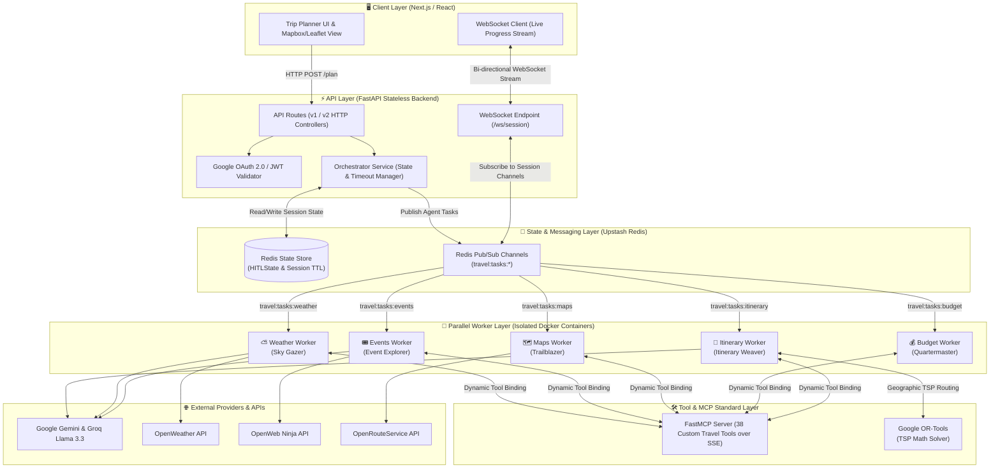
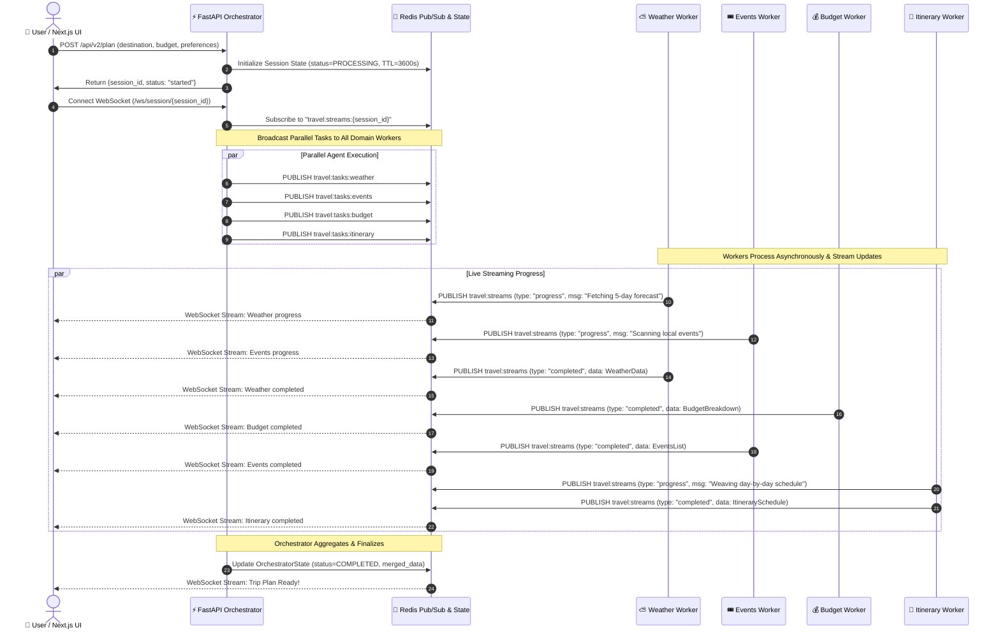
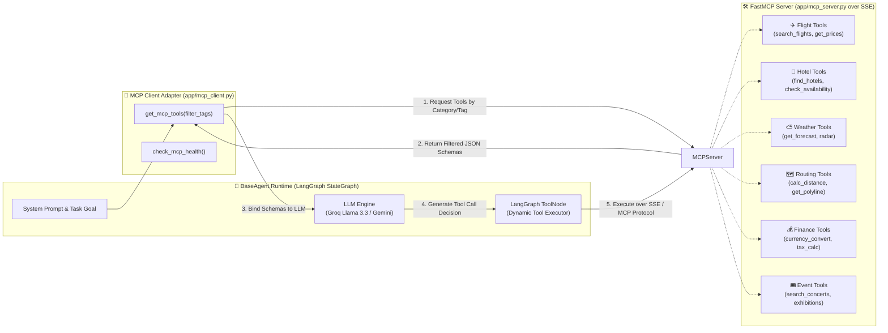
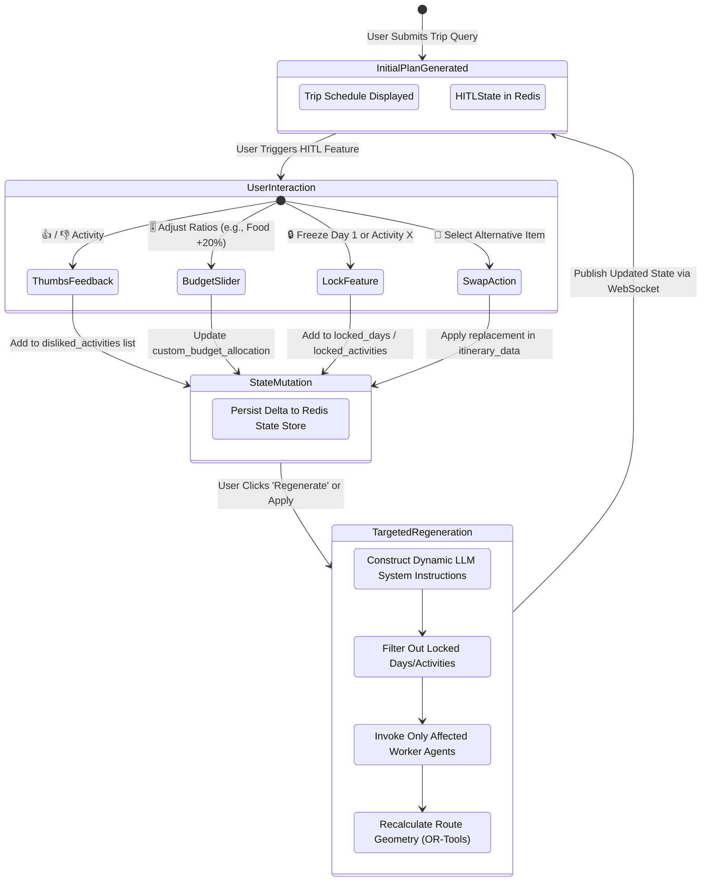
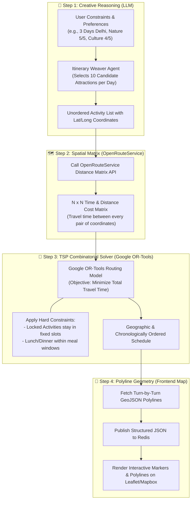
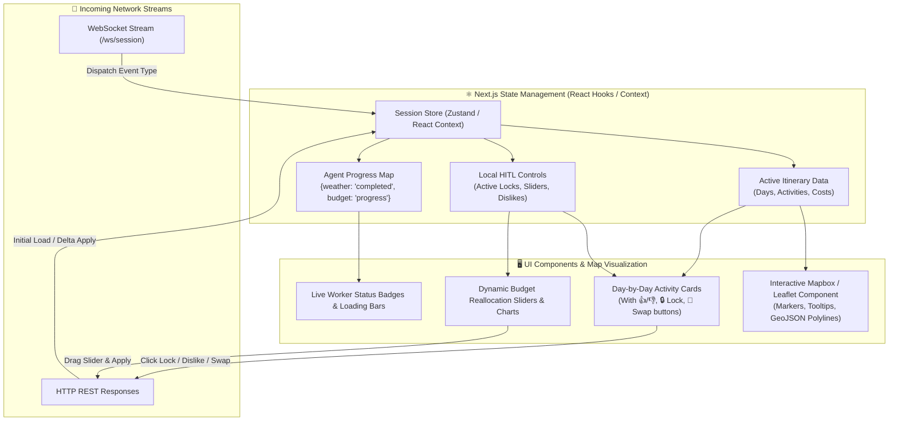

# 🎪 Ringmaster Round Table v2.0 (TBuddy) - Comprehensive Architecture & Workflow Diagrams

This document provides complete, visual Mermaid diagrams explaining every architectural layer, execution flow, algorithmic optimization, and interaction model of the **TBuddy / Ringmaster Round Table v2.0** platform. These diagrams are designed to be used during technical interviews, system design presentations, and onboarding.

---

## 1. High-Level System Architecture (HLD)

This diagram illustrates the end-to-end architecture, showing how the Next.js client interacts with the FastAPI backend over HTTP and WebSockets, how state is managed in Upstash Redis, how parallel worker agents execute via Pub/Sub, and how the standardized Model Context Protocol (MCP) server provides tools to agents.

---

## 2. Redis Parallel Worker & Pub/Sub Sequence Flow

Unlike sequential LLM pipelines that suffer from high latency, v2.0 executes domain agents concurrently. This sequence diagram shows how an incoming request is dispatched across Redis channels, processed simultaneously by containerized worker agents, and streamed back to the client in real time.

---

## 3. Model Context Protocol (MCP) & Dynamic Tool Binding

To prevent LLM context window bloat and tool hallucination, TBuddy integrates an MCP standard server exposing 38 travel tools. Rather than injecting all 38 schemas into every prompt, agents query the FastMCP server at runtime, inspect schemas, and dynamically bind only the tools required for their specific task.

---

## 4. Human-in-the-Loop (HITL) State Machine & Feedback Loop

When a user interacts with the 5 high-impact features (Thumbs Up/Down, Budget Reallocation Sliders, Day/Activity Locks, Pre-Trip Preference Poll, or Swap Suggestions), the system updates the `HITLState` in Redis and performs targeted delta-regeneration without recomputing the entire trip.

---

## 5. Algorithmic Routing & Hybrid Optimization (LLM + OR-Tools TSP)

LLMs are creative reasoning engines but fail at mathematical combinatorial optimization. TBuddy uses a **Hybrid Neuro-Symbolic Architecture**: the LLM selects theme-aligned activities, while Google OR-Tools solves the Traveling Salesperson Problem (TSP) to order locations geographically, minimizing travel time and distance.

---

## 6. Frontend Real-Time Streaming & UI State Synchronization

This diagram maps out how the Next.js React frontend manages application state across live WebSocket messages, user UI interactions, and map updates without freezing the browser DOM.

---

## Summary of Diagram Use Cases for Interviews
1. **Use Diagram 1 (HLD)** when asked: *"Explain the architecture of your project and how frontend/backend communicate."*
2. **Use Diagram 2 (Redis Pub/Sub)** when asked: *"How do you reduce latency and handle concurrent AI tasks?"* or *"Why Redis?"*
3. **Use Diagram 3 (MCP)** when asked: *"How do your agents interact with external tools without overloading the LLM context window?"*
4. **Use Diagram 4 (HITL State Machine)** when asked: *"How do your interactive features (locks, feedback, budget sliders) work without regenerating everything?"*
5. **Use Diagram 5 (Hybrid OR-Tools TSP)** when asked: *"How do you ensure geographical routing accuracy and prevent AI hallucination in scheduling?"*
6. **Use Diagram 6 (Frontend State)** when asked: *"How do you handle real-time streaming and map updates in Next.js?"*
