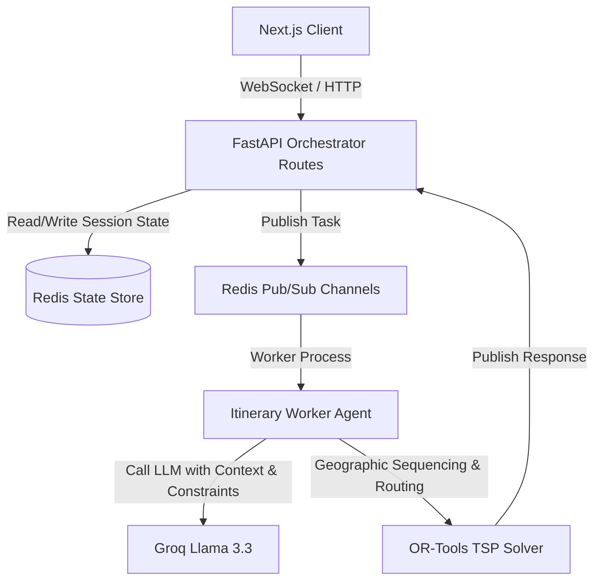

# High-Impact Human-in-the-Loop (HITL) Feature Design

This document outlines the architecture, data models, API endpoints, and LLM prompt engineering required to build the five High-Impact Interactive features for **TBuddy**.

---

## 1. System Architecture Overview

To support interactive changes (feedback, locking, budget reallocation, and alternative swaps), we will extend the existing **Orchestrator Session State** in Redis.



---

## 2. Updated State Schema (Redis Memory)

We will update the `OrchestratorState` (stored in Redis) to maintain state for locks, dislikes, preference weights, and budget allocations.

```python
class HITLState(TypedDict):
    # 1. Locks & Feedbacks
    locked_activities: List[str]      # List of activity IDs that cannot be modified (e.g. ["day1_act_0"])
    locked_days: List[int]            # List of day indexes completely locked (e.g. [1, 2])
    disliked_activities: List[str]    # List of activity IDs to be replaced in the next run
    
    # 2. Preference Weights (from Pre-Trip Poll)
    preference_weights: Dict[str, int] # e.g. {"culture": 4, "food": 3, "nature": 5}
    
    # 3. Custom Budget Breakdown
    custom_budget_allocation: Dict[str, float] # e.g. {"transport": 2500, "food": 4000, "activities": 1500}
```

This dictionary will reside under `state["user_preferences"]["hitl_state"]`.

---

## 3. Deep Dive: The 5 Features

---

### Feature 1: 👍👎 Activity Feedback → Regenerate

Allows the user to thumbs-up/lock or thumbs-down/replace individual activities.

#### A. API Contract
* **Endpoint:** `POST /api/v2/orchestrator/session/{session_id}/feedback`
* **Payload:**
```json
{
  "activity_id": "day_1_act_1",
  "feedback": "dislike" // Options: "like", "dislike", "neutral"
}
```

#### B. Execution Flow
1. **Frontend:** User clicks `👎` on "Explore Chandni Chowk" (`day_1_act_1`).
2. **Backend:** Adds `day_1_act_1` to `disliked_activities` list in Redis.
3. **Regeneration:** When the user hits "Apply Feedback & Regenerate":
   * The backend sends the full `itinerary_data` to the Itinerary Agent, marked with `disliked_activities`.
   * The **Itinerary LLM** is prompted:
     > "Replace the activity with ID `day_1_act_1` ('Explore Chandni Chowk') with a new activity in the same location and time-slot. Do NOT change any other activities."
4. **Post-Processing:** The new activity is swapped in, routing is re-optimized using OR-Tools, and the result is returned to the user.

---

### Feature 2: 🎚️ Budget Reallocation Sliders

Allows the user to adjust budget ratios (e.g., spending more on food, less on activities).

#### A. API Contract
* **Endpoint:** `POST /api/v2/orchestrator/session/{session_id}/budget-reallocate`
* **Payload:**
```json
{
  "allocations": {
    "accommodation": 0.40, // 40%
    "food": 0.35,          // 35% (increased)
    "activities": 0.10,    // 10% (decreased)
    "transport": 0.15      // 15%
  }
}
```

#### B. LLM Prompt Strategy (Itinerary/Budget Agent)
When the slider updates, the Orchestrator runs the Itinerary Agent with the new budget rules:
```text
The user has adjusted their budget preferences:
- Food budget is increased. Favor premium dining options, local street food tours, and culinary experiences.
- Activity budget is restricted. Replace premium ticketed locations with free attractions (parks, monuments with low entry fees, walking tours).
- Update the itinerary to match these revised constraints.
```

---

### Feature 3: 🔒 Lock & Regenerate

Allows the user to freeze specific days (e.g., keeping Day 1 intact while regenerating Day 2 & 3).

#### A. API Contract
* **Endpoint:** `POST /api/v2/orchestrator/session/{session_id}/lock`
* **Payload:**
```json
{
  "locked_days": [1],
  "locked_activities": ["day_2_act_0"]
}
```

#### B. Orchestrator Logic
When executing `itinerary_agent.py`:
1. The orchestrator pulls `locked_days` and `locked_activities`.
2. It constructs the prompt context:
```text
SYSTEM INSTRUCTION:
You are updating the user's travel itinerary.
- Day 1 is LOCKED. Do not make any modifications to Day 1.
- Activity "day_2_act_0" is LOCKED. Do not modify or replace it.
- Regenerate only the unlocked portions of the itinerary with fresh suggestions.
```

---

### Feature 4: ⚖️ Pre-Trip Preference Poll

A lightweight profile builder to align the itinerary's theme with user expectations.

```text
┌─────────────────────────────────────────────┐
│  What matters most to you?                  │
│  🏛️ Culture & History    [4 / 5]            │
│  🌿 Nature & Relaxation [5 / 5]            │
└─────────────────────────────────────────────┘
```

#### A. Implementation Flow
1. **Frontend:** Renders sliders before trip generation.
2. **Payload:** Sent in the initial `/plan` request:
```json
{
  "query": "Plan a 3-day trip to Delhi",
  "user_preferences": {
    "interests": {
      "culture": 4,
      "food": 3,
      "adventure": 2,
      "shopping": 1,
      "nature": 5
    }
  }
}
```
3. **LLM Prompt Context Insertion:**
```text
Select attractions matching the following weighted preferences:
- Nature & Relaxation (Weight: 5/5): Maximize time in gardens, parks, scenic views.
- Culture & History (Weight: 4/5): High priority on historic forts, museums, temples.
- Shopping (Weight: 1/5): Minimize market/mall stops.
```

---

### Feature 5: 🔄 Swap Suggestions

Provide the user with 3 immediate alternatives for any selected slot.

#### A. API Contract
* **Endpoint:** `GET /api/v2/orchestrator/session/{session_id}/swap-options`
* **Params:** `activity_id=day_1_act_2`
* **Response:**
```json
{
  "activity_id": "day_1_act_2",
  "alternatives": [
    {
      "name": "Mehrauli Archaeological Park",
      "description": "A historic park situated adjacent to the Qutub Minar complex.",
      "estimated_cost": "Free",
      "lat": 28.5204,
      "lng": 77.1852
    },
    {
      "name": "Garden of Five Senses",
      "description": "A quiet public park featuring theme areas and food courts.",
      "estimated_cost": "₹40",
      "lat": 28.5134,
      "lng": 77.1958
    }
  ]
}
```

#### B. Replacement Application API
* **Endpoint:** `POST /api/v2/orchestrator/session/{session_id}/swap-apply`
* **Payload:**
```json
{
  "activity_id": "day_1_act_2",
  "selected_alternative": {
    "name": "Garden of Five Senses",
    "description": "A quiet public park featuring theme areas and food courts.",
    "estimated_cost": "₹40",
    "lat": 28.5134,
    "lng": 77.1958
  }
}
```
* **Post-Apply Action:** The backend replaces the item in `itinerary_data`, triggers `route_optimizer.py` to update the Leaflet polyline sequences, and publishes the new state to Redis.

---

## 4. UI/UX Interaction Mockup

```text
+-------------------------------------------------------------------+
|  TBuddy Trip Planner                                              |
+-------------------------------------------------------------------+
|  Day 1: Old Delhi Exploration                       [ 🔒 Locked ] |
|  - 09:00 AM: Visit Red Fort                          [ 👍 ] [ 👎 ]|
|  - 11:30 AM: Explore Chandni Chowk                   [ 👍 ] [ 👎 ]|
|  - 03:00 PM: Jama Masjid evening walk                [ 👍 ] [ 👎 ]|
|                                                                   |
|  Day 2: South Delhi Heritage                        [ 🔓 Unlocked]|
|  - 10:00 AM: Visit Qutub Minar                       [ 🔄 Swap ]  |
|      |-> Alternatives:                                            |
|          1. Mehrauli Archaeological Park                          |
|          2. Garden of Five Senses (Select)                        |
+-------------------------------------------------------------------+
|  Budget Allocations:                                              |
|  Food:       [========o-------] 40% (₹4,000)                      |
|  Activities: [====o-----------] 15% (₹1,500)                      |
|  [ Regenerate Unlocked Items ]                                    |
+-------------------------------------------------------------------+
```

---

## 5. Next Steps for Implementation

1. **Database / Redis Schema Extension:** Add the fields under Section 2 to `orchestrator_agent.py`.
2. **API Endpoint Additions:** Implement the HTTP controllers in `orchestrator_routes_v2.py`.
3. **Itinerary Worker Refactoring:** Update the prompt template in `itinerary_agent.py` to dynamically structure LLM system prompts using lock variables and budget allocations.
4. **Map Recalculation Trigger:** Hook the feedback and swap application requests directly into `route_optimizer.optimize_full_itinerary` to ensure Leaflet renders correctly after swaps.
